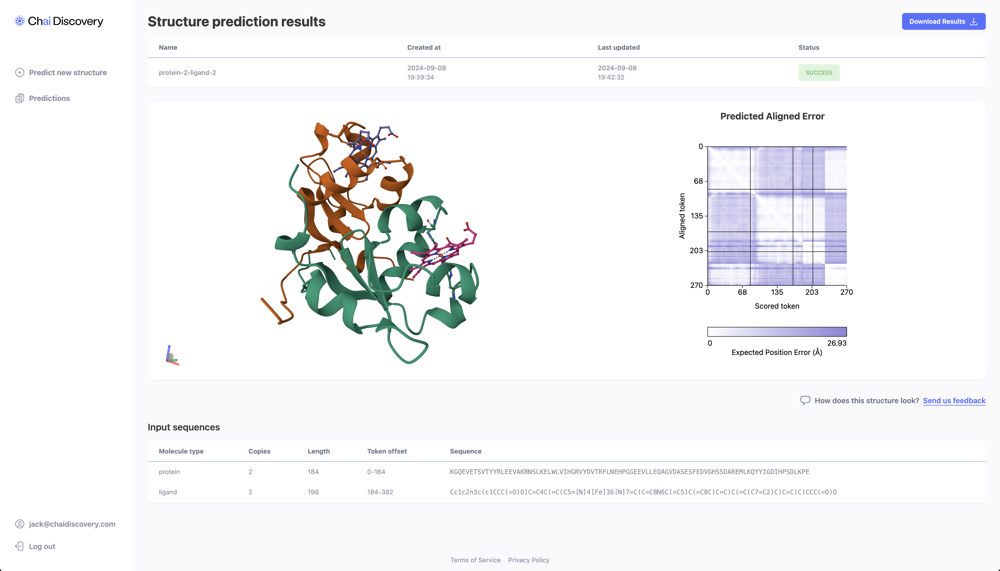
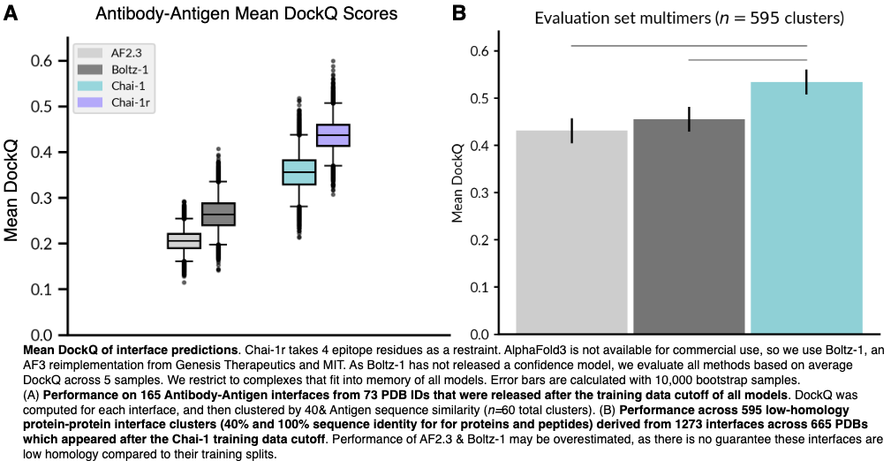

# Chai-1

Chai-1 is a multi-modal foundation model for molecular structure prediction that performs at the state-of-the-art across a variety of benchmarks. Chai-1 enables unified prediction of proteins, small molecules, DNA, RNA, glycosylations, and more.

<p align="center">
    
</p>

For more information on the model's performance and capabilities, see our [technical report](https://www.biorxiv.org/content/10.1101/2024.10.10.615955).

## Installation

```shell
# version on pypi:
pip install chai_lab==0.6.1

# newest available version (updates daily to test features that weren't released yet):
pip install git+https://github.com/chaidiscovery/chai-lab.git
```

This Python package requires Linux, Python 3.10 or later, and a GPU with CUDA and bfloat16 support. We recommend using an A100 80GB or H100 80GB or L40S 48GB chip, but A10 and A30 will work for smaller complexes. Users have also reported success with consumer-grade RTX 4090.

## Running the model

### Command line inference

You can fold a FASTA file containing all the sequences (including modified residues, nucleotides, and ligands as SMILES strings) in a complex of interest by calling:
```shell
chai-lab fold input.fasta output_folder
```

By default, the model generates five sample predictions, and uses embeddings without MSAs or templates. For additional information about how to supply MSAs, templates, and restraints to the model, see the documentation below, or run `chai-lab fold --help`.

For example, to run the model with MSAs (which we recommend for improved performance), pass the `--use-msa-server` and `--use-templates-server` flags:

```shell
chai-lab fold --use-msa-server --use-templates-server input.fasta output_folder
```

If you are hosting your own ColabFold server, additionally pass the `--msa-server` flag with your server:

```shell
chai-lab fold --use-msa-server --msa-server-url "https://api.internalcolabserver.com" input.fasta output_folder
```

We also provide additional utility functions for tasks such as MSA file format conversion; see `chai --help` for details.

### Pythonic inference

The main entrypoint into the Chai-1 folding code is through the `chai_lab.chai1.run_inference` function. The following script demonstrates how to provide inputs to the model, and obtain a list of PDB files for downstream analysis:

```shell
python examples/predict_structure.py
```

To get the best performance, we recommend running the model with MSAs. The following script demonstrates how to provide MSAs to the model.

```shell
python examples/msas/predict_with_msas.py
```

For further instructions, see `"How can MSAs be provided to Chai-1?"` below.

<details>
<summary>Where are downloaded weights stored?</summary>
<p markdown="1">
By default, weights are automatically downloaded and stored in <package_root>/downloads (usually that's within site-packages).
In cases where you want to control the download location (e.g. on a mounted drive in Docker), you can use the CHAI_DOWNLOADS_DIR envvar to control the download location. For example:

```bash
CHAI_DOWNLOADS_DIR=/tmp/downloads python ./examples/predict_structure.py 
```
</p>
</details>

<details>
<summary>How can MSAs be provided to Chai-1?</summary>
<p markdown="1">

Chai-1 supports MSAs provided as an `aligned.pqt` file. This file format is similar to an `a3m` file, but has additional columns that provide metadata like the source database and sequence pairing keys. We provide code to convert `a3m` files to `aligned.pqt` files. For more information on how to provide MSAs to Chai-1, see [this documentation](examples/msas/README.md).

For user convenience, we also support automatic MSA generation via the ColabFold [MMseqs2](https://github.com/soedinglab/MMseqs2) server via the `--use-msa-server` flag. As detailed in the ColabFold [repository](https://github.com/sokrypton/ColabFold), please keep in mind that this is a shared resource. Note that the results reported in our preprint and the webserver use a different MSA search strategy than MMseqs2, though we expect results to be broadly similar.

</p>
</details>

<details>
<summary>How can I customize the inputs to the model further?</summary>
<p markdown="1">

For more advanced use cases, we also expose the `chai_lab.chai1.run_folding_on_context`, which allows users to construct an `AllAtomFeatureContext` manually. This allows users to specify their own templates, MSAs, embeddings, and constraints, including support for specifying covalent bonds (for example, for specifying branched ligands). We currently provide examples of how to construct an embeddings context, an MSA context, restraint contexts, and covalent bonds. We will be releasing helper methods to build template contexts soon.

</p>
</details>

## ⚡ Try it online

We provide a [web server](https://lab.chaidiscovery.com) so you can test the Chai-1 model right from your browser, without any setup.

<p align="center">
    
</p>

## Using experimental restraints
Chai-1 uniquely offers the ability to fold complexes with user-specified "restraints" as inputs. These restraints specify inter-chain contacts or covalent bonds at various resolutions that are used to guide Chai-1 in folding the complex. See [restraints documentation](examples/restraints/README.md) and [covalent bond documentation](examples/covalent_bonds/README.md) for details.

<p align="center">
    
</p>

## 💬 Feedback

Found a 🐞? Please report it in GitHub [issues](https://github.com/chaidiscovery/chai-lab/issues).

We welcome community testing and feedback. To share observations about the model's performance, please reach via [GitHub discussions](https://github.com/chaidiscovery/chai-lab/discussions), or [via email](mailto:feedback@chaidiscovery.com).

## 🛠️ Development

We use [devcontainers](https://code.visualstudio.com/docs/devcontainers/containers) in development, which helps us ensure we work in identical environments. We recommend working inside a devcontainer if you want to make a contribution to this repository.

Devcontainers work on local Linux setup, and on remote machines over an SSH connection.

## Status

API is quite stable, but we recommend pinning the version in your requirements, i.e.:

```
chai_lab==0.6.1
```

## Citations

If you find Chai-1 useful in your research or use any structures produced by the model, we ask that you cite our technical report:

```
@article{Chai-1-Technical-Report,
	title        = {Chai-1: Decoding the molecular interactions of life},
	author       = {{Chai Discovery}},
	year         = 2024,
	journal      = {bioRxiv},
	publisher    = {Cold Spring Harbor Laboratory},
	doi          = {10.1101/2024.10.10.615955},
	url          = {https://www.biorxiv.org/content/early/2024/10/11/2024.10.10.615955},
	elocation-id = {2024.10.10.615955},
	eprint       = {https://www.biorxiv.org/content/early/2024/10/11/2024.10.10.615955.full.pdf}
}
```

You can also access this information by running `chai citation`.

Additionally, if you use the automatic MMseqs2 MSA generation described above, please also cite:

```
@article{mirdita2022colabfold,
  title={ColabFold: making protein folding accessible to all},
  author={Mirdita, Milot and Sch{\"u}tze, Konstantin and Moriwaki, Yoshitaka and Heo, Lim and Ovchinnikov, Sergey and Steinegger, Martin},
  journal={Nature methods},
  year={2022},
}
```


## Licence 

Chai-1 is released under an Apache 2.0 License (both code and model weights), which means it can be used for both academic and commerical purposes, including for drug discovery.

See [LICENSE](LICENSE).

To discuss partnership and access to new internal capabilities, reach us [via email](mailto:partnerships@chaidiscovery.com).
