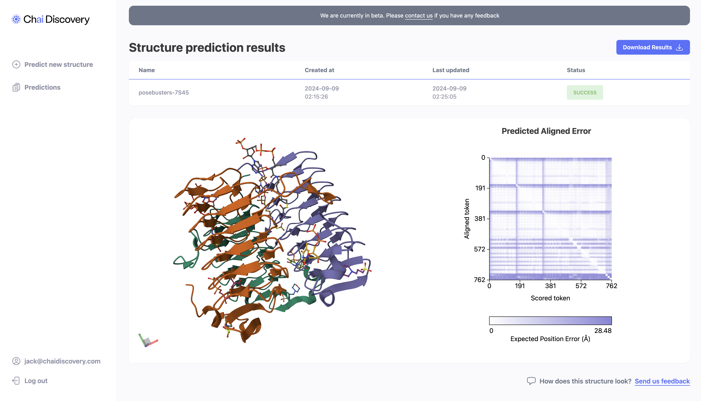

# Chai-1

Chai-1 is a multi-modal foundation model for molecular structure prediction that performs at the state-of-the-art across a variety of benchmarks. Chai-1 enables unified prediction of proteins, small molecules, DNA, RNA, glycosylations, and more.

<p align="center">
    
</p>

For more information on the model's performance and capabilities, see our [technical report](https://chaiassets.com/chai-1/paper/technical_report_v1.pdf).

## Installation

```shell
# current version (updates daily):
pip install git+https://github.com/chaidiscovery/chai-lab.git
# version on pypi:
pip install chai_lab==0.0.1
```

This Python package requires Linux, and a GPU with CUDA and bfloat16 support 

(we recommend A100/H100, but A10, A30 should work for smaller complexes. Users reported success with consumer-grade RTX 4090).


## Running the model

The model accepts inputs in the FASTA file format, and allows you to specify the number of trunk recycles and diffusion timesteps via the `chai_lab.chai1.run_inference` function. By default, the model generates five sample predictions, and uses embeddings without MSAs or templates.

The following script demonstrates how to provide inputs to the model, and obtain a list of PDB files for downstream analysis:

```shell
python examples/predict_structure.py
```

For more advanced use cases, we also expose the `chai_lab.chai1.run_folding_on_context`, which allows users to construct an `AllAtomFeatureContext` manually. This allows users to specify their own templates, MSAs, embeddings, and constraints. We currently provide an example of how to construct an embeddings context, and will be releasing helper methods to build MSA and templates contexts soon.

## ⚡ Try it online

We provide a [web server](https://lab.chaidiscovery.com) so you can test the Chai-1 model right from your browser, without any setup.

<p align="center">
    
</p>

## 💬 Feedback

Found a 🐞? Please report it in GitHub [issues](https://github.com/chaidiscovery/chai-lab/issues).

We welcome community testing and feedback. To share observations about the model's performance, please reach via [GitHub discussions](https://github.com/chaidiscovery/chai-lab/discussions), or [via email](mailto:feedback@chaidiscovery.com).

## 🛠️ Development

We use [devcontainers](https://code.visualstudio.com/docs/devcontainers/containers) in development, which helps us ensure we work in identical environments. We recommend working inside a devcontainer if you want to make a contribution to this repository.

Devcontainers work on local Linux setup, and on remote machines over an SSH connection.

## Status

Since this is an initial release, we expect to make some breaking changes to the API and are not guaranteeing backwards compatibility. We recommend pinning the current version in your requirements, i.e.:

```
chai_lab==0.0.1
```

## Licence 

See [LICENSE.md](LICENSE.md).

To discuss commercial use of our models, reach us [via email](mailto:partnerships@chaidiscovery.com).
