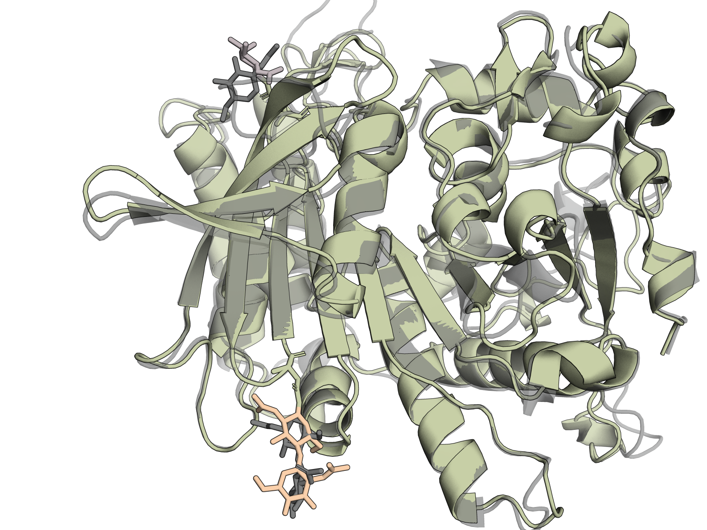
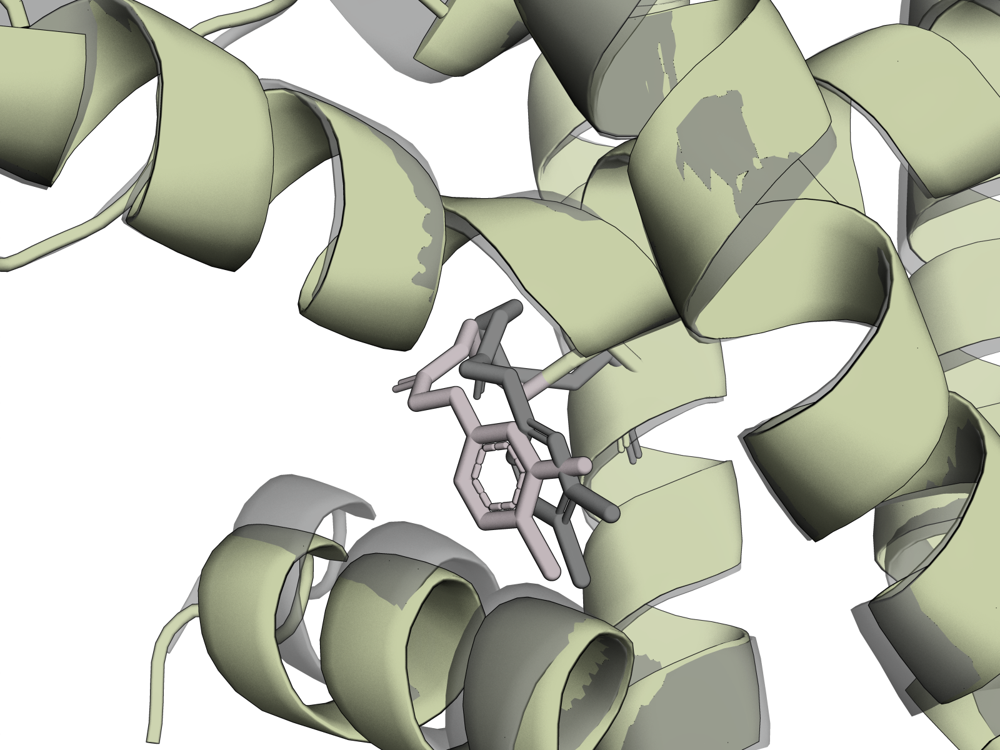

# Working with bond restraints

Chai-1 supports specifying covalent bonds as input, which specify covalent linkages between atoms in the folded complex. This is useful for specifying covalent modifications such as glycosylation events, but can be generally used to specify arbitrary "non-canonical" bonds in a structure; we demonstrate both cases below.

A few notes:
- Chai-1 was not trained on intra-chain bonds (e.g., disulfides), and we have not evaluated whether specifying such bond information yields expected behaviors.
- These bond restraints should not be used to specify modified amino acids that already have an associated CCD code; for these examples, include the modified residue's CCD code in parentheses directly in the sequence in place of its canonical residue, e.g., `RKDES(MSE)EES` to specify a selenomethionine at the 6th position.

## Glycans

We adopt an abbreviated syntax for specifying glycans, which is best explained with a series of examples.

### Single-ring glycan

Let's say we have a glycan that is a single sugar ring, a 2-acetamido-2-deoxy-beta-D-glucopyranose. The [CCD code](https://www.rcsb.org/ligand/NAG) for this sugar is `NAG`, so we simply specify this sugar with the following fasta entry:
```
>protein|example-protein
...N...
>glycan|example-single-sugar
NAG
```

Now, a glycan is also covalently bound to a residue; to specify this, we include the following line in our restraints file (see our documentation on restraints as well):

chainA|res_idxA|chainB|res_idxB|connection_type|confidence|min_distance_angstrom|max_distance_angstrom|comment|restraint_id
|---|---|---|---|---|---|---|---|---|---|
A|N436@N|B|@C1|covalent|1.0|0.0|0.0|protein-glycan|bond1

Breaking this down, this specifies that the within chain A (the first entry in the fasta), the "N" residue at the 436-th position (1-indexed) as indicated by the "N436" prefix is bound, via its nitrogen "N" atom as indicated by the "@N" suffix, to the C1 atom in the first glycan ("@C1"). Ring numbering follows standard glycan ring number schemas. For other ligands, you will need check how the specific version of `rdkit` that we use in `chai-lab` (run `uv pip list | grep rdkit` for version) assigns atom names and use the same atom names to specify your bonds. In addition, note that the min and max distance fields are ignored, as is the confidence field. 


### Multi-ring glycan

Working through a more complex example, let's say we have a two-ring ligand such as that shown in the PDB structure [1AC5](https://www.rcsb.org/structure/1ac5). We introduce syntax for specifying bonds **within glycans** within the fasta record as such:

```
>protein|example-protein
...N...
>glycan|example-dual-sugar
NAG(4-1 NAG)
```

This syntax specifies that the root of the glycan is the leading `NAG` ring. The parentheses indicate that we are attaching another molecule to the ring directly preceding the parentheses. The `4-1` syntax "draws" a bond between the O4 atom of the previous "root" `NAG` and the C1 atom of the subsequent `NAG` ring. Note that this syntax, when read left-to-right, is "building out" the glycan from the root sugar outwards.

To specify how this glycan ought to be connected to the protein, we again use the restraints file to specify a residue and atom to which the glycan is bound, and the carbon atom within the root glycan ring that is bound.

chainA|res_idxA|chainB|res_idxB|connection_type|confidence|min_distance_angstrom|max_distance_angstrom|comment|restraint_id
|---|---|---|---|---|---|---|---|---|---|
A|N436@N|B|@C1|covalent|1.0|0.0|0.0|protein-glycan|bond1

You can chain this syntax to create longer ligands:
```
>glycan|4-NAG-in-a-linear-chain
NAG(4-1 NAG(4-1 NAG(4-1 NAG)))
```

...and to create branched ligands
```
>glycan|branched-glycan
NAG(4-1 NAG(4-1 BMA(3-1 MAN)(6-1 MAN)))
```
This branched example has a root `NAG` ring followed by a `NAG` and a `BMA`, which then branches to two `MAN` rings. For additional examples of this syntax, please refer to the examples in `tests/test_glycans.py`.

### Glycan example

We have included an example of how glycans can be specified under `predict_glycosylated.py` in this directory, along with its corresponding `bonds.restraints` csv file. This example is based on the PDB structure [1AC5](https://www.rcsb.org/structure/1ac5). The predicted structrue (colored, glycans in purple and orange, protein in green) from this script should look like the following when aligned with the ground truth 1AC5 structure (gray):



## Non-glycan ligands

You can also use covalent bonds to "connect" residues to non-glycan ligands. To demonstrate this, we use a single subunit from the homodimer [8CYO](https://www.rcsb.org/structure/8cyo). We specify a fasta file with a protein sequence and SMILES string in `8cyo.fasta` (we use SMILES for demonstration purposes even though this specific ligand has a CCD code) and the corresponding restraints in `8cyo.restraints`. Folding this example with `predict_covalent_ligand.py` yields the following structure (RCSB ground truth structure shown in gray).



## A note on leaving atoms

One might notice that in the above example, we are specifying CCD codes for sugar rings and connecting them to each other and an amino acid residue via various bonds. A subtle point is that the reference conformer for these sugar rings include OH hydroxyl groups that leave when bonds are formed. Under the hood, Chai-1 tries to automatically find and remove these atoms (see `AllAtomStructureContext.drop_glycan_leaving_atoms_inplace` for implementation), but this logic only drops leaving hydroxyl groups within glycan sugar rings. For other, non-sugar covalently attached ligands, please specify a SMILES string *without* the leaving atoms. If this does not work for your use case, please open a GitHub issue.


